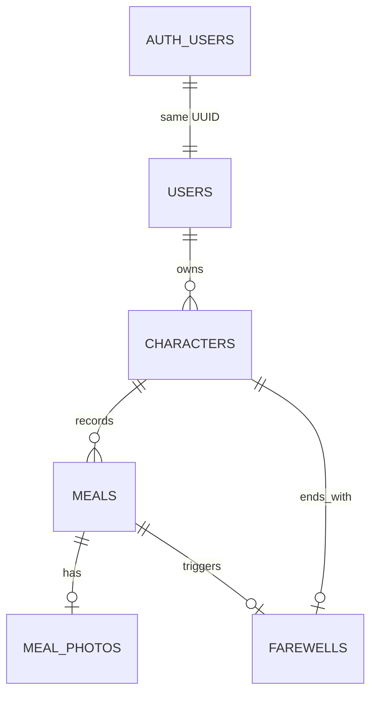

# DB設計

## 方針

アプリケーションデータにはPostgreSQLを使い、Supabaseへデプロイする。ローカル開発もSupabase CLIで起動したPostgreSQLを使い、同じmigrationを適用する。

FlutterがSupabaseから直接取得するのは認証情報だけで、食事・だしトモ・見送りなどのデータはGo APIを経由する。アプリケーションテーブルはData APIへ公開しない`app` schemaに置く。

食事写真の実体はCloudflare R2に保存し、DBにはprovider固有URLではなく`object_key`と検証済みmetadataを保存する。保存先を変えてもDBの参照形式を変えずに済むようにする。

## テーブル

### `app.users`

Supabase Authの`auth.users.id`と同じUUIDを主キーにする。匿名サインイン後、Go APIへの初回アクセスでこのレコードと第1世代のだしトモを同じtransaction内に作る。

`deletion_requested_at`は退会の猶予期間開始時刻を表す。猶予日数と猶予中の操作制限は未確定のため、DBの固定値や自動削除処理はまだ設けない。

### `app.characters`

ユーザーごとに`generation`を1から増やす。名前は作成時の必須項目とし、空白だけの値をDBで拒否する。部分unique indexにより、`farewelled_at is null`のだしトモは1ユーザーにつき最大1体に制限する。

見た目を生成するseedと生成方式のversionは未確定のため、現migrationには含めていない。食事回数は`app.meals`から数え、重複して保持しない。

### `app.meals`

食事日時は`occurred_at`へ`timestamp with time zone`で保存し、入力時のUTC offsetを`utc_offset_minutes`に残す。位置情報と栄養情報は保存しない。

`user_id`と`character_id`の複合外部キーにより、別ユーザーのだしトモへ食事を紐付けられない。料理名の最大文字数は未確定のため、空文字だけをDBで拒否する。

### `app.meal_photos`

`meal_id`を主キーにして、1食につき写真を最大1枚に制限する。食事と写真の作成はGo APIが1つのtransactionで行い、「食事には必ず写真が1枚ある」という最小件数を保証する。

R2へのuploadが完了してからDB transactionを開始する。DB保存に失敗したobjectは一時objectとしてcleanup対象にする。保持期間、画像形式、最大容量、最大辺は未確定。

### `app.farewells`

1体につき最大1回の見送りと、その契機になった食事を記録する。複合外部キーにより、見送り時刻が`app.characters.farewelled_at`と一致すること、契機の食事が同じだしトモに属することを保証する。見送り記録が存在する間、`app.characters.farewelled_at`は変更できず、契機の食事も削除できない。見送りを取り消す仕様を追加する場合は、同じtransaction内で`app.farewells`を先に削除する。

契機の食事がかつお菜料理であること、見送り済み世代の食事を変更しないこと、見送りと次世代作成を同じtransactionで行うことはGoのdomain/usecaseで保証する。見た目のsnapshotは生成方式が決まってから追加する。

## 操作単位

初回利用時は、アプリユーザーと第1世代のだしトモを同じDB transactionで作る。

通常の食事記録では、先にR2へ写真をuploadし、その後に食事と写真metadataを同じDB transactionで保存する。transactionが失敗した場合、upload済みobjectはcleanup対象として残す。

見送りでは、契機となる食事と写真metadataの保存、現在のだしトモの`farewelled_at`更新、`app.farewells`の作成、次世代のだしトモ作成を1つのDB transactionで行う。R2操作はDB transactionに含めない。

## 未確定事項

- 匿名アカウントから連携する認証provider
- だしトモの見た目seed、生成方式のversion、見送り時snapshot
- だしトモの名前の最大文字数
- 料理名の最大文字数
- 写真の形式、圧縮後の最大容量、最大辺、一時objectの保持期間
- かつお菜料理の見送り確認を取り消した場合の食事の扱い
- 退会猶予期間の日数と猶予中の操作制限
- Go APIが本番DBへ接続するときのroleと接続方式
